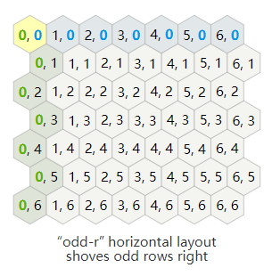

# 六边形网格地图

目前只支持 "odd-r" 一种形态的六边形网格:



参考文档：https://www.redblobgames.com/grids/hexagons/

# 接口
+ grid:set_obstacle(col, row, obstacle) 设置单个障碍
    + col 纵坐标(x)
    + row 横坐标(y)
    + obstacle 障碍标识()
+ grid:set_obstacles(list) 批量设置障碍
    + list: {col, row, obstacle}, {col, row, obstacle}, ...}
+ grid:pathfinding(c1, r1, c2, r2, camp) 寻路
    + c1 r1 起点坐标
    + c2 r2 终点坐标
    + camp 阵营
    + 返回路点格式 {{1, 1}, {2, 2}} (有可能会出现跳点)
+ grid:walkable(col, row, camp) 格子是否可行
    + col 纵坐标(x)
    + row 横坐标(y)
    + camp 阵营(不填默认被所有阵营阻挡)

待补充接口:
+ 获取某个格子的三维坐标(x, y, z)
+ 获取指定方向邻居的坐标点
+ 计算离不可达区域最近的点


# 方向定义
```c
// N, NE, E, SE, S, SW, W, NW
/*
    1    2
     \  /
  0 --  -- 3
     /  \
    5    4
*/
#define DIR_W  0
#define DIR_NW 1
#define DIR_NE 2
#define DIR_E  3
#define DIR_SE 4
#define DIR_SW 5

#define NO_DIRECTION 6
#define FULL_DIRECTIONSET 63
#define EMPTY_DIRECTIONSET 0
```

## 测试
```sh
make # 编译并运行test.lua
make debug # 编译debug模式打印详细日志
```

## 地图数据模板
```lua
{
    id = 101,   -- RTS地图唯一id
    w = 10,     -- 地图宽
    h = 5,      -- 地图高
    blocks = {  -- 网格配置
        {col = 1, row = 0, obstacle = true, area = 3, terrain = 101},
        {col = 1, row = 1, obstacle = true, area = 3, terrain = 102},
        {col = 1, row = 2, obstacle = true, area = 3, terrain = 103},
        {col = 1, row = 3, obstacle = true, area = 3, terrain = 104},
        {col = 5, row = 3, area = 2, terrain = 105},
        {col = 0, row = 0, area = 1, terrain = 105},
    },
}
```
block字段
+ col 纵坐标
+ row 横坐标
+ obstacle 有障碍不可通行
+ area 区域类型
+ terrain 地形(草地山川之类的)
>blocks暂时用col，row配置有内容的格子，没有配置的格子默认可走，等编辑器完成后则不再需要col和row，用数组配满所有格子

## 类型定义
```lua
-- 区域类型
M.AREA_TYPE = {
    CROSSING  = 1, -- 路口
    TENT      = 2, -- 营帐区
    BLANK     = 3, -- 空白
}

-- 建筑类型
M.BUILDING_TYPE = {
    TENT         = 1, -- 营帐
    MINE         = 2, -- 矿
    REJECT_HORSE = 3, -- 拒马
    ARROW_TOWER  = 4, -- 箭塔
}

-- 单位类型
M.ELEM_TYPE = {
    TEAM    = 1, -- 队伍
    MONSTER = 2, -- 怪物
}
```
